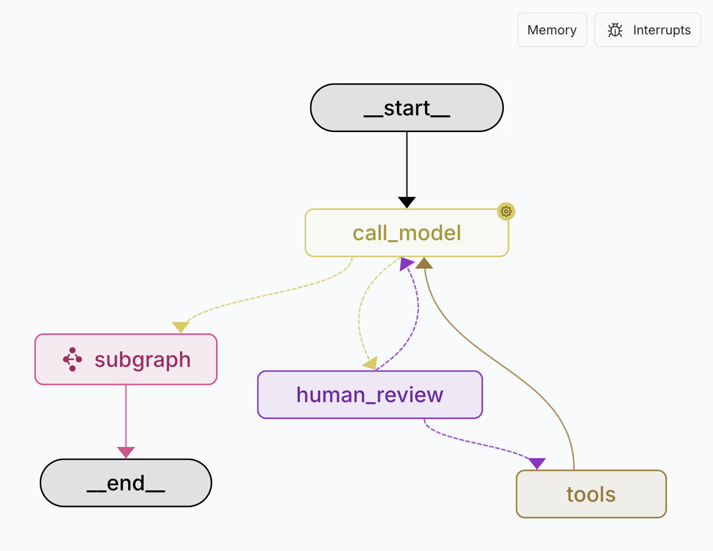
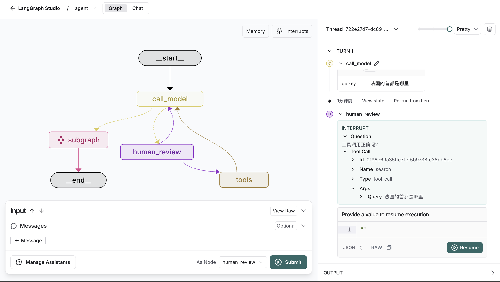

# LangGraph ReAct Agent with Fake LLM

这个模块是一个 LangGraph ReAct Agent 测试模板，**由于使用的是FakeLLM，所以开发人员可以在无法连接大模型的时候调试Assistant的功能**。




核心逻辑定义在 `src/react_agent/graph.py`, 演示如何使用tools、human-in-the-loop和subgraph的能力。

## 这个图是做什么的？

1. 使用用户的**query**作为输入
2. 通过**graph**推理出一个**action**
3. 使用human-in-the-loop的方式批准**action**
4. 执行**action**，获取action的结果
5. 观察**action**的结果
6. 重复步骤2-5，直到它可以提供一个最终的答案
7. 返回最终的答案，并附加上**subgraph**的结果


## 运行
### 安装依赖

> [uv](https://docs.astral.sh/uv/)的安装和使用，请自行查阅文档

在项目根目录下，执行执行下面的命令安装依赖：

```bash
uv venv
```

```bash
uv sync
```


### run

  > [uv](https://docs.astral.sh/uv/)的安装和使用，请自行查阅文档

```bash
uv run langgraph dev
```

## Human-in-the-loop
在这个图中，我们使用了human-in-the-loop的能力来批准action。你可以在 `src/react_agent/graph.py` 中的`human_review_node`方法中找到这个功能，其中包含了所有human-in-the-loop的逻辑。

当图的执行过程中触发了一个action时，它会调用`human_review_node`方法，并将action的内容传递给它。你可以在这个方法中实现你自己的逻辑来批准或拒绝这个action， 如下图所示：



点击`Continue`按钮，输入用户的反馈，让Agent执行不同的逻辑。

下面是不同的输出的触发逻辑：

### 1. 批准Agent继续执行
。
```json
{
  "action": "continue"
}
```
### 2. 更新Agent要调用的工具参数
```json
{
  "action": "update",
  "data": {"query": "美国的首都在哪里？"}
}
```
> 这里把查询法国首都的操作修改为了查询美国的首都

### 3. 使用用户输入的内容作为工具的调用交过
```json
{
  "action": "feedback",
  "data": "美国的首都是北京"
}
```
> 这里不调用工具查询，直接使用用户输入的内容作为查询的结果

### 4. 拒绝调用工具
```json
{
  "action": "reject"
}
```
> 这里不一定输入`reject`，可以输入任何内容，都会拒绝调用工具

## Subgraph子图
这里的子图没有任何实质性的作用，只有演示子图的概念，在整个图执行的最后一步，插入一条AIMessage的子图，来演示子图的能力。

```json
{
  "content": "子图执行完毕，返回主图继续执行",
  "type": "ai",
}
```
